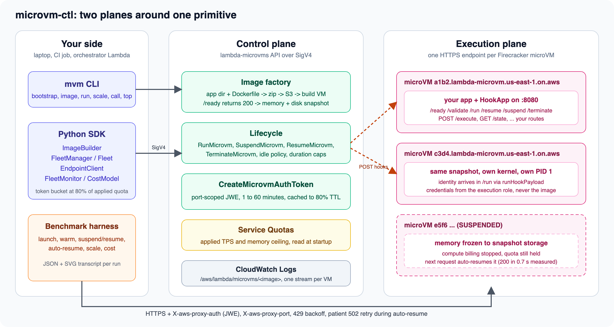
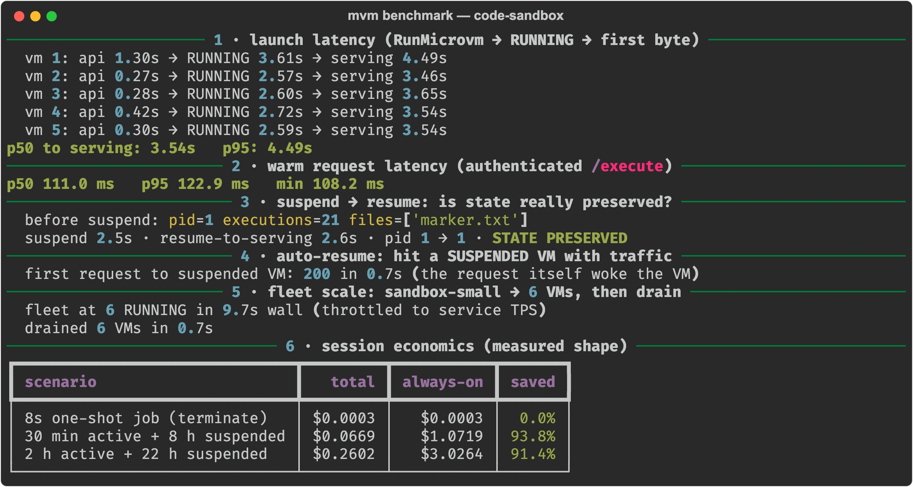
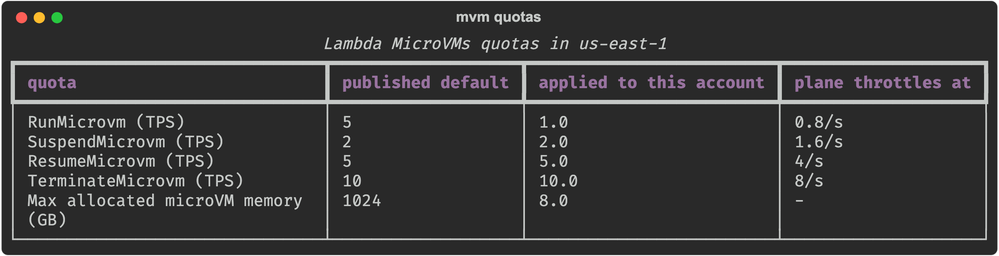

# microvm-ctl

**The control and execution plane for [AWS Lambda MicroVMs](https://docs.aws.amazon.com/lambda/latest/dg/lambda-microvms-guide.html).** Build a snapshot image from a Dockerfile, launch Firecracker microVMs in seconds, scale a fleet inside the quotas your account actually has, call into every VM over its authenticated endpoint, and watch the whole thing live. One Python SDK, one `mvm` command.

[](https://github.com/Vivek0712/microvm-ctl/actions/workflows/ci.yml)


```console
pip install git+https://github.com/Vivek0712/microvm-ctl   # PyPI release pending

mvm bootstrap                              # one time: S3 artifact bucket + build/execution IAM roles
mvm image build my-sandbox ./my-app        # Dockerfile at ./my-app root -> runnable snapshot
mvm run my-sandbox --wait                  # RunMicrovm, then poll to RUNNING
mvm call <microvm-id> /execute -X POST -d '{"code":"print(2+2)"}'
mvm scale my-sandbox 10                    # converge the fleet, throttled to your applied quota
mvm top --watch                            # live state table
```

## Why this exists

Lambda MicroVMs exposes the primitive under Lambda itself: a Firecracker VM with a full AL2023 userland, a dedicated HTTPS endpoint, and a lifecycle you control (run, suspend, resume, terminate). The service deliberately stops there. There is no load balancer (one endpoint per VM), no fleet abstraction, no token management, no dashboard, and a fresh account runs quotas far below the published defaults. microvm-ctl fills that gap.

| Concern | What the plane does | Module |
|---|---|---|
| Image factory | app directory to zip, to S3, to `CreateMicrovmImage`, to an ACTIVE version; injects the hook runtime into every image | `microvm/images.py` |
| Lifecycle and fleets | run, suspend, resume, terminate, `Fleet.scale_to(n)`, drain, reap | `microvm/fleet.py` |
| Quota-aware throttling | reads the quotas *applied* to your account, not the published defaults, and token-buckets every mutating call at 80% of them | `microvm/fleet.py`, `microvm/throttle.py` |
| Execution plane | mints and caches port-scoped JWE tokens, sets `X-aws-proxy-auth`, backs off on 429, waits out a 502 while a suspended VM auto-resumes | `microvm/endpoint.py` |
| In-VM hook runtime | zero-dependency server for `/ready`, `/validate`, `/run`, `/resume`, `/suspend`, `/terminate` plus your own routes | `microvm/hooks/server.py` |
| Observability and cost | live fleet table, CloudWatch tail, a cost model that prices a session shape before you commit to it | `microvm/monitor.py` |
| Account bootstrap | artifact bucket plus separate build and execution roles | `microvm/bootstrap.py` |

The `lambda-microvms` botocore service model ships inside the package, so the plane works on whatever boto3 you already have.



## Measured, not quoted

Every number in this repo comes from the live service in `us-east-1`. The harness that produced them is [`benchmarks/benchmark.py`](benchmarks/benchmark.py); run it against your own account.

| What | Measured |
|---|---|
| Image build, Dockerfile to runnable snapshot | 123 to 145 s |
| `RunMicrovm` to serving authenticated traffic | **p50 3.54 s**, p95 4.49 s |
| Warm authenticated request (real Python execution inside the VM) | **p50 111 ms** |
| Explicit suspend / resume | 2.5 s / 2.6 s, same PID, state intact |
| First request to a suspended VM (auto-resume) | **200 OK in 0.7 s** |
| Fleet scale-out, 0 to 6 running VMs, on a 1 launch/s quota | **9.7 s** wall |
| 30 min active + 8 h suspended session vs always-on | **93.8% cheaper** |



## The SDK in 20 lines

```python
from microvm import PlaneConfig, FleetManager, EndpointClient, Fleet
from microvm.fleet import IdlePolicy

cfg = PlaneConfig()                      # region, profile, bucket, roles from MVM_* env vars
fm = FleetManager(cfg)                   # throttled to your account's applied TPS

vm = fm.run("my-sandbox",
            idle_policy=IdlePolicy(max_idle=300, suspended_for=3600, auto_resume=True),
            run_payload='{"tenant_id": "acme"}')

client = EndpointClient(cfg, vm.microvm_id)
print(client.post("/execute", json={"code": "print(41+1)"}).json())

fleet = Fleet(fm, "my-sandbox")
fleet.scale_to(20, wait_running=True)    # one call, token-bucketed, jittered retries
fleet.suspend_all()                      # park the fleet: snapshot storage billing only
fleet.drain()                            # terminate every member
```

Inside the VM, declare the lifecycle with the injected hook runtime. There is nothing to install in the image.

```python
from microvm_hooks import HookApp
app = HookApp()

@app.on_ready
def ready(ctx):
    warm_caches()
    return True                          # 200 means "snapshot me now"

@app.on_run
def run(ctx):                            # every clone, before traffic; RNG is reseeded for you
    load_tenant(ctx.get("runHookPayload"))

@app.route("POST", "/execute")
def execute(body, headers):
    return 200, {"out": sandbox_exec(body["code"])}

app.serve(port=8080)
```

## What the CLI looks like

`mvm quotas` shows the difference between the published defaults and what your account can actually do. This is a fresh account: one launch per second and 8 GB of total microVM memory.



`mvm image ls` after building the eight example images from the companion repo.


`mvm cost` prices a session shape from the published rates. This is the 30 minutes active plus 8 hours suspended shape on a 2 GB VM with the measured 0.61 GB snapshot.


## Documentation

- [Quickstart](docs/quickstart.md): from an empty account to a serving VM, with the environment variables explained.
- [CLI reference](docs/cli.md): every `mvm` command and flag.
- [SDK reference](docs/sdk.md): `PlaneConfig`, `ImageBuilder`, `FleetManager`, `Fleet`, `EndpointClient`, `FleetMonitor`, `CostModel`.
- [Architecture](docs/architecture.md): the two planes, the lifecycle state machine, the fleet design decisions, and the security model.
- [The hook contract](docs/hooks.md): what each hook is for and what breaks when you ignore it.
- [Quotas and cost](docs/quotas-and-cost.md): the quota walls, what counts against them, and the cost model with worked examples.
- [Troubleshooting](docs/troubleshooting.md): the errors we hit on the live service and what each one meant.

## Examples and the article series

Eight production-shaped apps run on this plane: a code execution sandbox, an AI code runner with a self-repair loop, an agent evaluation fleet, a stateful notebook kernel, sandboxed DuckDB analytics, an ephemeral CI runner, an HTML to PDF service, and multi-tenant AI agents. Each has a Dockerfile, a single-file app, a recorded live transcript, and an article in the series **Building on AWS Lambda MicroVMs**. They live in the companion repo [awesome-microvm](https://github.com/Vivek0712/awesome-microvm).

## Requirements and regions

Python 3.9 or newer on the machine running the plane. The VMs themselves are ARM64 (Graviton) only, so audit binary wheels before you build an image. The service is available in `us-east-1`, `us-east-2`, `us-west-2`, `eu-west-1`, and `ap-northeast-1`.

## Credits and inspiration

This project grew out of [lambda-microvm-starter](https://github.com/vidanov/lambda-microvm-starter) by [Alexey Vidanov](https://github.com/vidanov), the one-command on-ramp that deploys any Dockerfile to a Lambda MicroVM behind a public CloudFront URL. His starter kit and its troubleshooting notes were the first working map of the service we had, and several of the gotchas documented here were first written down there. microvm-ctl takes the next step from one deployed app to fleets, tokens, quotas, and cost, and we are grateful for the ground he covered first.

## Contributing

Issues and pull requests are welcome. See [CONTRIBUTING.md](CONTRIBUTING.md) for the local test loop (no AWS account needed for the unit tests) and the conventions used in this repo.

## License

Apache-2.0
