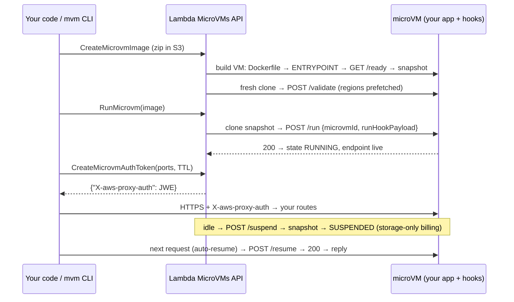

# Architecture

## The two planes

**Control plane** — talks to the `lambda-microvms` API (SigV4, us-east-1 et
al). Owns images, lifecycle, fleets, tokens, quotas, and cost attribution.
Lives on your machine / your orchestrator Lambda / your CI.

**Execution plane** — one HTTPS endpoint per microVM
(`<id>.lambda-microvm.<region>.on.aws`). Owns request auth (JWE tokens in
`X-aws-proxy-auth`), port routing (`X-aws-proxy-port`, default 8080), retries,
and the in-VM hook server.

## Lifecycle state machine

`PENDING → RUNNING ⇄ (SUSPENDING → SUSPENDED → resume) → TERMINATING → TERMINATED`

- Suspension triggers: idle policy (`maxIdleDurationSeconds` without endpoint
  traffic) or explicit `SuspendMicrovm`.
- Wake triggers: explicit `ResumeMicrovm`, or any endpoint request when
  `autoResumeEnabled` (the request is held while the VM restores; a failure
  surfaces as 502).
- Termination triggers: explicit, `suspendedDurationSeconds` elapsed while
  suspended, `maximumDurationInSeconds` total, or the 8-hour hard ceiling.
- Cost by state: RUNNING = vCPU+memory per second · SUSPENDED = snapshot
  storage only · TERMINATED = zero.

## Fleet design decisions

- **No service-side load balancer exists** — one endpoint per VM. Routing is a
  control-plane concern; `Fleet` + `EndpointClient` give you the primitives,
  and the eval harness shows round-robin over N clients.
- **Quota-aware throttling.** The applied (per-account) rates are read from
  Service Quotas at startup — new accounts run reduced profiles (we measured
  RunMicrovm at 1/s and 8 GB total memory on a fresh account vs published
  defaults of 5/s and 400+ GB). All mutating calls ride token buckets at 80%
  of the applied rate with jittered backoff.
- **Memory quota is the real ceiling** and it counts RUNNING + SUSPENDED
  *and build VMs*. A fleet that suspends instead of terminating still consumes
  quota — `scale_to` therefore terminates suspended members first on the way
  down.
- **Every launch sets duration caps.** Runaway-agent spend is capped at run
  time (`maximumDurationInSeconds`, `suspendedDurationSeconds`), and
  `Fleet.reap()` backstops both.

## Security model

- No unauthenticated path to a VM: every request needs a port-scoped, expiring
  token minted through IAM-authenticated `CreateMicrovmAuthToken`. Scope
  tokens to exactly the ports a caller needs; `EndpointClient` defaults to
  `[8080]`, not all-ports.
- Build role ≠ execution role. The sandbox's role never reads your artifact
  bucket; the build role never gets workload permissions.
- Secrets: never in the image (env vars and snapshot RAM are both cloned).
  Deliver per-VM context via `runHookPayload`; fetch secrets in `/run` with
  the execution role.
- Ingress connectors: `ALL_INGRESS` (default), `NO_INGRESS` (push-only /
  maximum containment), `SHELL_INGRESS` (interactive shell — gate it).
  Egress: `INTERNET_EGRESS` or a VPC network connector.
